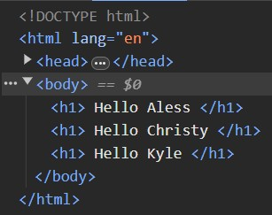

# EJS with Express

## This guide assumes you are familiar with the following concepts
- You are comfortable writing Javascript and HTML
- You are familiar with Express.js 
    - [ExpressJS](https://expressjs.com/)
- Basic understanding of HTTP
    - [HTTP](https://developer.mozilla.org/en-US/docs/Web/HTTP)

### Introduction
- The purpose of this section is to introduce you to using EJS template engine with an express server to render dynamic HTML in the browser. We will set up a simple server with a home route and pass some data from our Javascript file to be displayed when the request is made. As mentioned above we are assuming that you already have a basic understanding of HTTP methods and how an express server is set up.

## Using EJS Templates in Express
1\. Set up a basic express app
    - We recommend copying the Hello World starter code from the express documentation here:
        - [Hello World in Express](https://expressjs.com/en/starter/hello-world.html)
    
```js
const express = require('express')
const app = express()
const port = 3000
app.get('/', (req, res) => {
    res.send('Hello World!')
})
app.listen(port, () => {
console.log(`Example app listening on port ${port}`)
})
```

- We recommend using nodemon to run your express server, but it is not necessary
    - [Nodemon](https://www.npmjs.com/package/nodemon)
- Start your server to test everything is working correctly (Node <filename>.js or Nodemon <filename>.js)


2\. Set Up EJS file
    - Set up your EJS file the same way you would for an HTML file, just use the extension .ejs instead of .html

```html
<!DOCTYPE html>
<html lang="en">

<head>
    <meta charset="UTF-8">
    <meta name="viewport" content="width=device-width, initial-scale=1.0">
    <title>Example EJS</title>
</head>

<body>

    <h1>Hello World</h1>

</body>

</html>
```

- Lets test that we can display this file using our express server
3\. Next we need to change ```res.send``` to ```res.render``` and pass the filename we would like our server to render when the specified HTTP request is made
- In order to let express know which file extension to look for when sending responses, we set the `view engine` in our express server with the following line of code

``` js
app.set('view engine', 'ejs')
```

4\. The view engine requires all of our ejs files to be put into a folder called 'views'
    - Express will look into this folder to match the filename we pass into our ```res.render``` function
    - You do not need to pass the file extension into ```res.render``` after setting the view engine

```js hl_lines="5 8"
const express = require('express')
const app = express()
const port = 3000

app.set('view engine', 'ejs')

app.get('/', (req, res) => {
    res.render('index')
})

app.listen(port, () => {
    console.log(`Example app listening on port ${port}`)
})
```

- You should now see the heading Hello World if you go to localhost:3000 in your browser
    

## Rendering Dynamic EJS

### Passing in Data
4\. Let's pass in some data to be rendered in the browser
- Inside our index.js file, let's make an array of people

```
const people = ['Aless', 'Christy', 'Kyle']
```

5\. We can pass this data into our ```res.render``` function inside the second parameter
    - The second parameter requires your variables to be inside a Javascript Object
    - If your key is the same name as your variable, you do not need to specify the value

```js hl_lines="3"
app.get('/', (req, res) => {
    res.render('index',{ people })
})
```

6\. Inside of our ejs file, we can use the EJS tags to execute Javascript logic before the page is rendered
    - Lets set up a simple loop to show all of the people in our array on the page

```html hl_lines="3"
<body>
    <% for (const person of people) { %>
        <h1> Hello <%= person %> </h1>  
    <% } %>

</body>
```

7\. Restart your server and refresh the page on the browser, you should now see the following on the page


- If we take a look at the developer tools, we can see the HTML that was sent to the browser once our file was rendered

- As you can see, the login in our EJS file was executed, and the results were sent to the browser as plain HTML

### Passing in Multiple Variables
- You can pass in as many variables as you like into the ```res.render``` function
- Let's assume someone is logged in on your web app, and you want to display their name on the page, and a list of their friends

8\. Make the following changes to your index.js code

```js hl_lines="7-8 11"
const express = require('express')
const app = express()
const port = 3000

app.set('view engine', 'ejs')

const user = 'Sam'
const people = ['Aless', 'Christy', 'Kyle']

app.get('/', (req, res) => {
    res.render('index',{ friends: people, user })
})

app.listen(port, () => {
    console.log(`Example app listening on port ${port}`)
})
```

9\. Update your EJS file by adding the following lines

```html hl_lines="12-20"
<!DOCTYPE html>
<html lang="en">

<head>
    <meta charset="UTF-8">
    <meta name="viewport" content="width=device-width, initial-scale=1.0">
    <title>Example EJS</title>
</head>

<body>

    <h1> Welcome <%= user %> </h1>

    <h3>List of friends</h3>

    <ul>
        <% for (const person of friends) { %>
            <li> <%= person %> </li>  
        <% } %>
    </ul>

</body>

</html>
```
10\. Restart your server and refresh the page on the browser, you should now see the following on the page


11\. Congratulations! You have taken the first steps towards building a dynamically rendered web app! 
